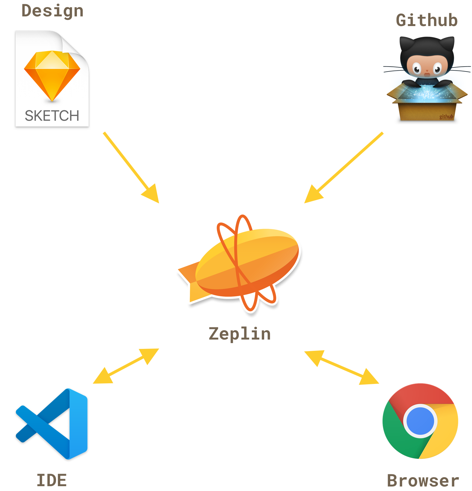
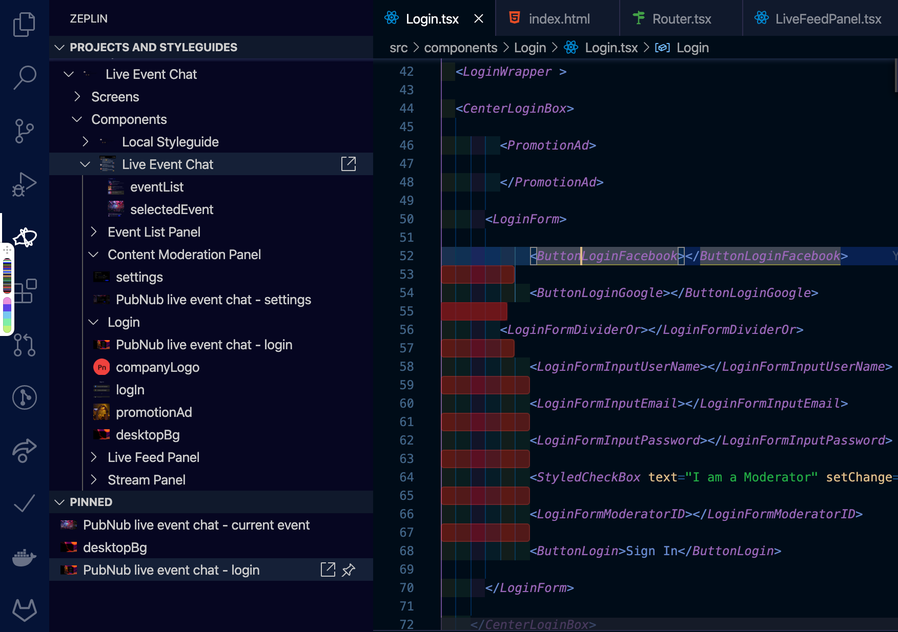

# ReactJS Live Stream Chat Starter Kit


#### Project status 
- LOTS OF CHANGES WILL UPDATE STATUS SOON
- Development environment can be started with `yarn install && yarn start`
- Template design Sketch file is symbolized to prepare for one to one maping with React components.
- Login page is "pixel perfect" beside color and luminosity to be fixed.
- Event page is now more advanced but I had to modify the Sketch file and split the EventInfo Sketch component into two while keeping the first one to comply with Styled Components requirements, but then found a way to make it transparent to events (click events, not only the event being displayed per say).
- Event Page is now accessible upon app run. Login Screen can be bypassed (search for Router.tsx below for more information)

#### Background
React JS is now the most used framework used by Internet companies to develop the web apps they generate most revenue from.

TypeScript is a type safe language built on top of java script and it is now the new standard in the React JS world.

React offers an easy way to group UI elements into Components so a Chat application can turn from a 100 UI objects, or more, to a 5 UI objects application, and experience less than 250ms delivery time from anywhere to anywhere in the world.

Once a developer uses React Components it becomes a matter of hours before a full fledged mission critical chat solution is offered to anyone in the world who wants to connect.

By leveraging open source tools and components it is possible to create a world class, mission critical, and maintainable chat service, surfacing over the web and mobile devices, while relying on an infrastructure provider to deliver messages anywhere on the Internet.

A reliable Chat back-end provider offers message deliverability, presence indicators and other related data in a predictable fashion so the React based front end can not only be suited to users taste and current habits but, no puns intended, also react to network messages without which there is no UI that would serve any user.

## What to do with this repository?

This is an example of how to integrate open source components, including React chat components, with one notable message and presence service provider: PubNub. 

Even though PubNub is offering a solid Java Script SDK to drive the React components along with the business specific logic, you will not need it to know it to run this demo. It is preferable to be familiar with Typescript and React if you wish to modify our React Components for your own use.

This repository is based, not only on a reliable chat backend provider, already processing billions of messages, but also it is based only on open source tools with significant following on github so there is a better chance to see them maintained in the future.

You should only have to bring the design if you want to change it and the repository does provide some starter ones.

The repository includes the javascript libraries that allow for easier access to the chat service provider without the need to use a lower level interface such as REST.

It also includes standard React components that can be dressed up through so named "Styled Components".

The Sketch file in this repository contains reusable UI symbols. And even you do not need to be familiar with Sketch Symbols, if you are, you can leverage the latest Sketch technology, including "Symbol Overrides" to completely customize the UI without loosing any time.

Sketch Overrides save time because this feature allows to use only one Sketch visual component per visual state this component will display once live on the screen.
Using Overrides one can simply override each component property, including graphics and see how the new graphics integrate in the live template inside Sketch. If you have professional designers available to you they will certainly appreciate the time it saves them to start from Sketch files including relevant Overrides properties set.


## What does this repository contain?

* A sample Sketch design file that maps to the css delivered in the source code so your Chat app can look designer generated.

* React files, and React js libraries, in typescript, allowing to run a web server application for hosting a Chat app. It can run on your computer or served hosted anywhere on the Internet for public access (The goal of this repo is not based on best security practices so you may want to bring in your security expert before doing so).

* A list of third party libraries used in the app is available in the package.json file. The command « yarn install » ran from the terminal will update your code with fresh cloned files for the versions of these libraries indicated right after their names under the header: dependencies in the package.json file located at the top of the project directory.

* The PubNub Live Event Chat Component library to display the chat UI and content.


## In the project directory:

1. Install ReactJS if not done already.
2. Clone this repository in your work directory.
3. Try this Web App on your computer. Launch a terminal, cd in the project directory and type each command below, then press enter, the last command should run the server and launch your web browser and connect to the localhost and the right port automatically:

    `yarn install`

    `yarn start`

To learn more about the file structure and which file you have to modify so you can make your own Live Stream Event Chat App with your own design please read the Customization section included here.

If you want to bypass our beautiful login screen and access the Live Event selection process directly you can edit the Router.tsx file around line 14 and change true to false in: 
```tsx
<Wrapper>
      <AppStateProvider>
      {true  ? <ChatDemo /> : <Login  />}
      </AppStateProvider>
</Wrapper>
```
(no need to restart since webpack reloads the chat server files automatically when detecting a change in one of them):
 
`directToEvent = true;`

## Visuals

### Login:


The code  to customize the Login screen with your design can be found in /src/components/PromotionAd/PromotionAd.styles.tsx
To change the design all you need to do is edit the design file included inside the directory: The name of the file is Login.style.tsx.
You can try it out by adding your own image file instead of the one on the login screen for example:
1. Drop a file into the /src/img directory and remember its name because you will need it in the next step.
2. Then simply change the name of the image file in the PromotionAd.style.tsx where it shows: `background: url("images/promotionAd.png") no-repeat;`

### Live Event

The Live Event screen itself is divided into multiple panels, each panel matches a component, which itself can contain more components in order to make make the UI more modular when needed.


#### ChatDemo
This is the main screen where participants can view the Event and chat with other event participants.
It is located in the src/components/ChatDemo/ChatDemo.tsx file:

````tsx
  <ChatDemoWrapper >

     <EventDetailsTop/>

     <LiveFeedPanel videoID="jZtxlp664yU"  opts={opts} onReady="(event) => {
       event.target.pauseVideo();
     }"/>

   <EventDetailsBottom />

     <MessageListPanelWrapper>

          <MessageListPanel/>

     </MessageListPanelWrapper>

  </ChatDemoWrapper>
````

#### LiveFeedPanel
This is the part of the screen where the event itself is to be displayed. 

This is a simple example using a YouTube stream that is simple passed inside the LiveFeedPanelWrapper tags.

The parameters to control the display of the YouTube stream source is passed using props.


These props are passed from a higher level component in the component tree where you have previously defined them, so there should be no need to edit this file unless you want to add a streaming provider of your own or change the settings for the default Stream provider.
```tsx
 <LiveFeedPanelWrapper>

      <YouTube videoId={props.videoID} opts={props.opts} onReady={props.onReady} />

      <CreateEventWrapper>

                  <EventNameWrapper>
                      <EventNameInput></EventNameInput>
                  </EventNameWrapper>

                  <HostNameWrapper>
                    <HostNameInput></HostNameInput>
                  </HostNameWrapper>

                  <CreateEventButtonWrapper>
                  <ButtonCreateEvent>START EVENT</ButtonCreateEvent>
                  </CreateEventButtonWrapper>

      </CreateEventWrapper>

 <LiveFeedPanelWrapper>
```
#### MessageListPanel

```tsx
      <AppStateProvider>
        {<MessageList messages={state.messages}/>}
      </AppStateProvider>
```

#### ComposeMessageBoxWrapper


````tsx   
      <ComposeMessageBoxWrapper>
        <UserImgWrapper src="/images/hostImage@3x.png" />
        <TextInputWrapper></TextInputWrapper>
        <EmojiInputWrapper src="/images/emojiInput@3x.png" />
      </ComposeMessageBoxWrapper>
````


### Event selection:

TO BE COMPLETED

### Moderator:

TO BE COMPLETED

## Using the Sketch file

This Live Event Chat app is based on a professional UI design built with [Sketch](https://www.sketch.com/). You can find the Sketch file used for this design in the root of this repository in a file named: "Live Event Chat.sketch".

The Sketch file contains Sketch "Symbols". Each Symbol matches a React Component and a React "Styled Component".

### PubNub Symbols

The simplest way to modify the provided Sketch file design provided and to quickly reflect the changes in the app is by modifying the matching Symbol in the Sketch file for the React Component you wish to change the display for.

The best way to understand the relationship between components and the Sketch file Symbols is by cutting the code as shown below. A React Component named PromotionAd is cut before being pasted again, and before it is pasted again you see the picture disappear on the page rendered in the browser. This illustrate the correspondance between the code and the visibility of a component rendered live on the screen:


This was about deleting the PromotionAd component all together from the page. But say you want to change the picture but keep that PromotionAd React Component on the page, then, first open the Sketch file and find the promotionAd Symbol then we will use the very powerful "Symbol Override" feature to pick another picture and easilly export it from Sketch to our img directory that contains all our images assets. You can see how it is done below:

Open the Sketch file and select "Layers" from the Side Bar on the left of the screen. Type: "promotionAd" in the "Search Layer" box then click on Symbol in the Inspector pane on the right of the screen:
   
 	


## Updating the Sketch file and generating new elements

TO BE COMPLETED

### Sync css and graphics manually from included Sketch designs

TO BE COMPLETED

### Continuous integration of updated included Sketch designs

TO BE COMPLETED

## Get started with the code template

### Using the PubNub Chat Components

#### Login
TO BE COMPLETED: SHOW VISUAL MAP

##### In: src/components/Login.tsx

```tsx
...

interface LoginInitProps {
 simulate: true
}


const Login: React.SFC<LoginInitProps> = (props: LoginInitProps) => {

return(

  <PubNubDesigner>

  <CenterLoginBox>

        <PromotionAd>

        </PromotionAd>

      <LoginForm>

            <ButtonLoginFacebook></ButtonLoginFacebook>
          
            <ButtonLoginGoogle></ButtonLoginGoogle>
         
        <LoginFormDividerOr></LoginFormDividerOr>
          
            <LoginFormInputUserName></LoginFormInputUserName>
            
            <LoginFormInputEmail></LoginFormInputEmail>
            
            <LoginFormInputPassword></LoginFormInputPassword>
            
            <StyledCheckBox text="I am a Moderator"></StyledCheckBox>
            <LoginFormModeratorID></LoginFormModeratorID>
            
            <ButtonLogin>Sign In</ButtonLogin>

      </LoginForm>

    </CenterLoginBox>

  </PubNubDesigner>
);
...
```


## Learn More

TO BE COMPLETED

### About React:

TO BE COMPLETED

### About TypeScript:

TO BE COMPLETED

### About PubNub React library for Java Script: 

TO BE COMPLETED

### About Styled Components: https://styled-components.com/docs/basics#styling-any-component 

TO BE COMPLETED

### About Sketch: 

TO BE COMPLETED

## Third party tools

### Zeplin





